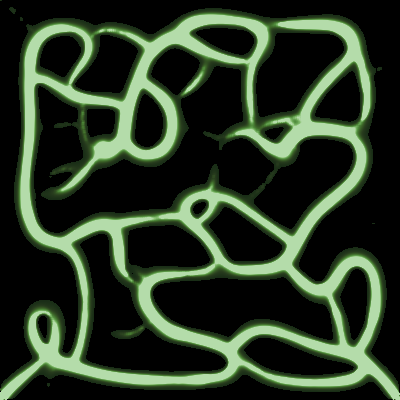
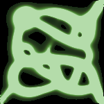
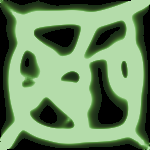
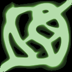
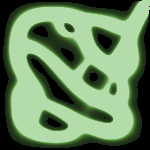
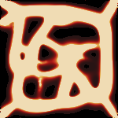
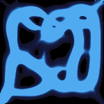
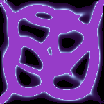
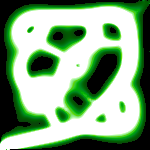
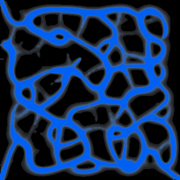

# tslime

<div align="center">

**Terminal Slime Mold Simulation**

A lightweight terminal screensaver simulating the mesmerizing growth patterns of *Physarum polycephalum* (slime mold).

[](https://github.com/yourusername/tslime/actions)
[](LICENSE)

[] · [Screenshots](#screenshots) · [Installation](#installation) · [Usage](#usage)

</div>

---

## 🎬 Demo

Watch the magic of slime mold in action:

### Featured: Network Formation

Dense, interconnected networks forming in real-time (400x400, 60 frames):


### Presets in Action

Each preset creates distinct visual patterns:

| Network | Exploratory | Organic | Tendrils |
|:-------:|:-----------:|:-------:|:--------:|
|  |  |  |  |
| Dense branching | Wide exploration | Balanced growth | Long arms |

### Color Palettes

Choose from 12+ built-in palettes for different moods:

| Heat | Ocean | Neon | Slime |
|:----:|:-----:|:----:|:-----:|
|  |  |  |  |

### Special Effects

**Multi-species mode** - Different agents with distinct colors:



---

## 🌿 Overview

**tslime** brings the emergent, network-forming behavior of slime mold to any terminal emulator. Inspired by [cbonsai](https://gitlab.com/jallbrit/cbonsai), it encodes natural growth algorithms into beautiful terminal art.

The simulation runs at higher resolution than the terminal display, downsampling to produce smooth, organic visuals that evolve continuously. Watch as branching, pulsing networks form, dissolve, and reform—perfect for idle terminals or aesthetic computing.

### Key Features

- **Beautiful Generative Art**: Organic, algorithmically-driven animations
- **Lightweight**: < 5% CPU, < 10MB memory
- **Cross-Platform**: Linux, macOS, Windows, and SSH
- **Zero Runtime Dependencies**: Single static binary
- **Configurable**: Multiple presets, palettes, and tunable parameters
- **Multiple Modes**: Screensaver, live animation, print mode
- **GIF Export**: Capture beautiful animations to share

---

## 🚀 Quick Start

### Installation

#### Using Cargo (Recommended)

```bash
cargo install tslime
```

#### Build from Source

```bash
git clone https://github.com/yourusername/tslime.git
cd tslime
cargo build --release
cargo install --path .
```

#### Package Managers (Coming Soon)

- **Homebrew** (macOS/Linux): `brew install tslime` — *Task 22 pending*
- **AUR** (Arch Linux): `yay -S tslime` — *Task 23 pending*

### Basic Usage

Run in screensaver mode (exit on any keypress):

```bash
tslime -S
```

Press any key to exit, or `Ctrl+C` to quit.

---

## 📸 Screenshots

### Presets

tslime includes several carefully tuned presets for different visual styles. See the [Demo](#-demo) section for animated examples.

#### Network Preset
Dense network formation with rapid branching.

```bash
tslime -S --preset network
```

#### Exploratory Preset
Scattered, searching behavior with long tentacles.

```bash
tslime -S --preset exploratory
```

#### Organic Preset (Default)
Balanced, natural appearance.

```bash
tslime -S --preset organic
```

#### Tendrils Preset
Long branching arms stretching across the terminal.

```bash
tslime -S --preset tendrils
```

### Color Palettes

Choose from 12+ built-in color palettes for different moods:

| Palette | Flag | Description |
|---------|------|-------------|
| Organic (default) | `--palette organic` | Green/yellow gradient |
| Heat | `--palette heat` | Black to red/orange |
| Ocean | `--palette ocean` | Blue to cyan gradient |
| Neon | `--palette neon` | Purple/pink electric |
| Slime | `--palette slime` | Bright green glow |
| Mono | `--palette mono` | Grayscale ramp |
| Forest | `--palette forest` | Natural greens |
| Warm | `--palette warm` | Earth tones |
| Vibrant | `--palette vibrant` | Saturated colors |
| Mold | `--palette mold` | Yellow/olive tones |
| Fungus | `--palette fungus` | Brown/green fungi |
| Swamp | `--palette swamp` | Dark murky greens |

Example:

```bash
tslime -S --palette ocean
```

### ASCII Mode

For older terminals or pure text output:

```bash
tslime -S --ascii --colors 16
```

---

## 📖 Usage

### Modes

```bash
tslime [OPTIONS]

MODES:
    (default)       Run simulation, exit on stable state or interrupt
    -l, --live      Continuous animation mode
    -S, --screensaver  Screensaver mode (exit on any keypress)
    -p, --print     Print single frame and exit (for piping/screenshots)
```

### Exporting GIFs

Generate high-quality GIF animations from the simulation:

```bash
# Basic GIF export
tslime --export-gif output.gif --export-frames 50 --export-fps 30

# With specific preset and resolution
tslime --export-gif organic.gif --preset organic --resolution 400x400 --export-frames 100

# With custom color palette
tslime --export-gif heat_demo.gif --palette heat --export-frames 60 --export-fps 20
```

**Options:**
| Flag | Default | Description |
|------|---------|-------------|
| `--export-gif <PATH>` | — | Output GIF file path |
| `--export-frames <N>` | 50 | Number of frames to capture |
| `--export-fps <N>` | 30 | GIF playback speed (frames/second) |
| `--frame-skip <N>` | 50 | Simulation steps between frames |

### Common Examples

**Reproducible simulation with specific seed:**

```bash
tslime -S --seed 12345
```

**Custom parameters for denser networks:**

```bash
tslime -S --sensor-angle 15 --decay 0.85 --population 100000
```

**High-resolution true color mode:**

```bash
tslime -S --colors true --resolution 800x800 --fps 60
```

**Export single frame to file:**

```bash
tslime -p --seed 42 > frame.txt
```

**Lower frame rate for slower terminals:**

```bash
tslime -S --fps 15
```

### Exit Modes

- **Screensaver mode**: Press any key to exit
- **Live/Default mode**: Press `q` or `Ctrl+C` to exit

---

## ⚙️ Configuration Reference

### Simulation Parameters

| Parameter | Flag | Type | Default | Range | Description |
|-----------|------|------|---------|-------|-------------|
| Population | `-n`, `--population` | int | 50,000 | 1,000–200,000 | Number of agents |
| Sensor Angle | `--sensor-angle` | float | 22.5° | 5°–90° | Angle between sensors |
| Sensor Distance | `--sensor-distance` | float | 9.0 | 1.0–50.0 | Distance to sensor points |
| Rotation Angle | `--rotation-angle` | float | 45.0° | 5°–90° | Turn amount per step |
| Step Size | `--step-size` | float | 1.0 | 0.5–5.0 | Movement per step |
| Decay Factor | `--decay` | float | 0.9 | 0.5–0.99 | Trail persistence |
| Deposit Amount | `--deposit` | float | 5.0 | 1.0–20.0 | Pheromone deposited |

### Display Parameters

| Parameter | Flag | Type | Default | Range | Description |
|-----------|------|------|---------|-------|-------------|
| Frame Delay | `-t`, `--time` | float | 0.033s | 0.001–1.0 | Frame delay in seconds |
| Target FPS | `--fps` | int | 30 | 1–120 | Target frames per second |
| Resolution | `--resolution` | WxH | 400×400 | 100×100–800×800 | Simulation resolution |
| Color Mode | `--colors` | enum | 256 | 8, 16, 256, true | Color mode |
| Character Mode | `--ascii`, `--braille` | flag | half-block | — | Character set |

### Other Options

| Parameter | Flag | Description |
|-----------|------|-------------|
| Seed | `-s`, `--seed INT` | Random seed for reproducibility |
| Preset | `--preset NAME` | Use named preset (network, exploratory, tendrils, organic) |
| Palette | `--palette NAME` | Color palette (organic, heat, ocean, mono) |
| Export GIF | `--export-gif PATH` | Export simulation to GIF file |
| Export Frames | `--export-frames N` | Number of frames for GIF (default: 50) |
| Export FPS | `--export-fps N` | GIF playback speed (default: 30) |
| Verbose | `-v`, `--verbose` | Print performance stats to stderr |
| Help | `-h`, `--help` | Print help information |
| Version | `-V`, `--version` | Print version |

---

## 🎨 Presets

Presets combine multiple parameters for distinctive visual styles:

### Network

Creates dense, interconnected networks with rapid branching.

```bash
tslime -S --preset network
```

**Parameters:**
- Sensor Angle: 15° (narrow sensing)
- Decay: 0.85 (trails fade quickly)
- Rotation: 30° (sharp turns)

Best for: Seeing how agents form efficient transport networks.

### Exploratory

Agents explore widely with long, searching tentacles.

```bash
tslime -S --preset exploratory
```

**Parameters:**
- Sensor Angle: 45° (wide sensing)
- Decay: 0.96 (trails persist longer)
- Rotation: 60° (wide turns)
- Population: 30,000 (fewer agents)

Best for: Watching exploratory behavior and space-filling patterns.

### Tendrils

Long branching arms stretch across the terminal.

```bash
tslime -S --preset tendrils
```

**Parameters:**
- Sensor Angle: 30° (medium sensing)
- Step Size: 2.0 (fast movement)
- Decay: 0.90 (moderate persistence)
- Population: 40,000

Best for: Visualizing tendril-like growth patterns.

### Organic (Default)

Balanced, natural-looking growth.

```bash
tslime -S --preset organic
```

**Parameters:**
- Sensor Angle: 22.5° (default)
- Decay: 0.9 (default)
- Rotation: 45° (default)

Best for: Casual viewing and balanced aesthetics.

---

## 🔬 How It Works

tslime implements the agent-based model from Jeff Jones' 2010 paper *"Characteristics of Pattern Formation and Evolution in Approximations of Physarum Transport Networks."*

### The Algorithm

1. **Sense**: Each agent samples the pheromone trail map at three positions (front-left, front-center, front-right)
2. **Rotate**: Adjust heading based on sensed values—agents follow stronger trails
3. **Move**: Update position based on heading and step size
4. **Deposit**: Add pheromone to trail map at new position
5. **Diffuse**: Apply 3×3 blur to spread pheromone
6. **Decay**: Multiply all trail values by decay factor (0.75–0.99)

### Rendering

The simulation runs at 400×400 resolution (configurable) and is downsampled to fit the terminal. Output uses:

- **Half-block characters** (▀▄█) for 2× vertical resolution
- **256-color ANSI** gradients for smooth color transitions
- **Average pooling** downsampling for organic appearance

---

## 💻 Performance

tslime is optimized for lightweight operation:

| Metric | Target | Method |
|--------|--------|--------|
| Memory | < 10 MB | Pre-allocated buffers |
| CPU (30 FPS) | < 5% | Efficient algorithms |
| Startup | < 100ms | Minimal initialization |
| Binary Size | < 3 MB | Stripped release build |

### Optimization Strategies

- **Cache-friendly iteration**: Row-major access patterns
- **No allocations in hot loops**: Reused frame buffers
- **Batch terminal writes**: Single `write()` per frame
- **SIMD-ready diffusion**: Ready for future optimizations

---

## 🖥️ Compatibility

### Tested Terminals

| Terminal | Platform | Status |
|----------|----------|--------|
| iTerm2 | macOS | ✅ Full support |
| Terminal.app | macOS | ✅ Full support |
| Alacritty | Cross | ✅ Full support |
| GNOME Terminal | Linux | ✅ Full support |
| Konsole | Linux | ✅ Full support |
| Windows Terminal | Windows | ✅ Full support |
| tmux | Cross | ✅ Full support |
| PuTTY | Windows | ⚠️ 16-color only |
| SSH | All | ✅ Full support |

### Requirements

- **Rust**: 1.70+ (for building from source)
- **Terminal**: ANSI color support recommended
- **Resolution**: Minimum 20×10 terminal cells

---

## 🔧 Development

### Building

```bash
# Debug build
cargo build

# Release build (optimized)
cargo build --release
```

### Testing

```bash
# Run all tests
cargo test

# Run with output
cargo test -- --nocapture

# Run specific test
cargo test test_agent_rotate
```

### Linting & Formatting

```bash
# Check code style
cargo fmt --check

# Format code
cargo fmt

# Lint with warnings as errors
cargo clippy -- -D warnings
```

### Code Style

- **Indentation**: 4 spaces
- **Line limit**: 100 characters
- **Naming**: `snake_case` for functions/variables, `PascalCase` for types
- **No comments in production code** (self-documenting)

### Visual Regression Tests

Golden tests ensure consistent output across versions:

```bash
# Regenerate golden files (for intentional changes)
UPDATE_GOLDEN=true cargo test

# Run visual regression tests
cargo test --test visual_regression
```

---

## 🤝 Contributing

Contributions are welcome! Areas of interest:

- **GPU acceleration**: OpenCL/Metal compute shaders
- **New presets**: Interesting parameter combinations
- **Color palettes**: Additional gradient schemes
- **Documentation**: Examples, tutorials, translations
- **Optimization**: SIMD, parallelization, memory improvements

### Development Workflow

1. Fork the repository
2. Create a feature branch (`git checkout -b feature/amazing-feature`)
3. Commit changes (`git commit -m 'Add amazing feature'`)
4. Push to branch (`git push origin feature/amazing-feature`)
5. Open a Pull Request

---

## 📄 License

This project is licensed under the MIT License - see the [LICENSE](LICENSE) file for details.

---

## 🙏 Acknowledgments

- **Jeff Jones**: For the original Physarum simulation algorithm
- **cbonsai**: For inspiring the terminal-based approach
- **crossterm**: For excellent cross-platform terminal handling

---

## 📚 References

1. Jones, J. (2010). "Characteristics of Pattern Formation and Evolution in Approximations of Physarum Transport Networks." *Artificial Life*, 16(2), 127-153.
2. [cbonsai](https://gitlab.com/jallbrit/cbonsai)
3. [crossterm](https://docs.rs/crossterm)
4. [ANSI Escape Codes](https://en.wikipedia.org/wiki/ANSI_escape_code)

---

<div align="center">

Made with ❤️ by the tslime contributors

[⬆ Back to top](#tslime)

</div>
