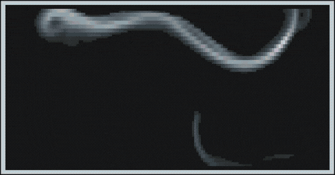
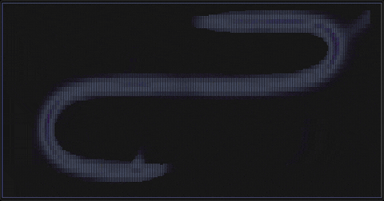
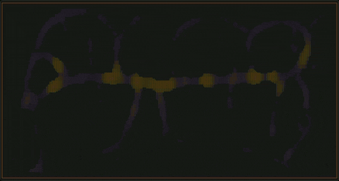
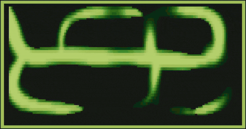
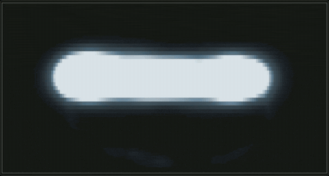

<p align="center">
  
</p>
<h1 align="center">TSLIME</h1>

A terminal screensaver, simulation playground and keyboard fidget toy. It runs a Physarum polycephalum (slime mold) transport-network
simulation. Tens of thousands of agents deposit and follow pheromone trails, and the
resulting network is drawn straight into your terminal. It ships as a single static
binary, runs on Linux, macOS, Windows, and over SSH. 

## Install

### Any platform — cargo

```bash
cargo install tslime
```

Builds from source (requires Rust 1.70 or later). This is the universal path
and sidesteps macOS Gatekeeper entirely.

### macOS — Homebrew

```bash
brew install tamirelazar/tslime/tslime
```

### Linux / Windows — prebuilt binary

Download from the [latest release](https://github.com/tamirelazar/tslime/releases/latest):

- **Linux** — `tslime-linux-x86_64` is statically linked and runs on any x86_64
  Linux distribution:

  ```bash
  chmod +x tslime-linux-x86_64 && ./tslime-linux-x86_64
  ```

- **Windows** — `tslime-windows-x86_64.exe`. SmartScreen may warn about the
  unsigned executable; click **More info → Run anyway**.

> macOS prebuilt binaries are not published — use Homebrew or `cargo install`
> (both avoid Gatekeeper). ARM Linux (aarch64): use `cargo install`.

### From source

```bash
git clone https://github.com/tamirelazar/tslime.git
cd tslime
cargo build --release
./target/release/tslime
```

## Usage

Run with no arguments for the interactive mode:

```bash
tslime
```

Screensaver mode exits on the first keypress:

```bash
tslime -S
```

Some of the presets I use come pre-loaded and are bound to the `1`-`4` keys. You can bind any preset or saved-config to the number keys via a config file.

In general, mature (= fun to play with) features will have runtime controls, while experimental features will be reachable through cli flags. I try to keep the really nascent stuff behind a compilation flag as well, but be aware that if something is not in the control console (reachable by pressing `h`) - it is not guaranteed to work.

`tslime --help` lists every flag. `tslime --explain` walks through what each
simulation parameter does and how the parameters interact.

### Custom Keybinds

Customize quick-keys `1`–`7` by creating a `~/.config/tslime/keybinds.toml` file with the following format:

```toml
[[keybind]]
key = "4"
preset = "fire"

[[keybind]]
key = "5"
config = "my-night-config"
```

- **Keys**: Bind to any digit `1`–`7`. Keys `1`–`4` default to Organic, Constellation, Vinescii, and Trademark; user entries override.
- **Targets**: Bind to either a `preset` (any of ~31 named presets) or a `config` (any saved configuration from `Ctrl+S`).
- **Comparison**: Press `Shift+1` through `Shift+7` to compare the bound preset or config against the current settings (A/B mode).
- **Live bindings**: The `?` overlay shows current key bindings and their targets.

## Gallery

tslime is a live instrument, not a static screensaver — every visual is reshaped
from the keyboard while it runs. A few of the controls:

<table>
<tr>
<td width="50%"><br><b>Palette cycling</b> — press <code>c</code> to sweep through palettes; the whole field recolors instantly.</td>
<td width="50%"><br><b>Character sets</b> — press <code>`</code> to re-render the same growth in a different glyph language.</td>
</tr>
<tr>
<td width="50%"><br><b>Preset transitions</b> — quick-keys <code>1</code>–<code>7</code> switch presets with an optional figlet announcement.</td>
<td width="50%"><br><b>Randomize</b> — press <code>8</code> to scramble every parameter into a fresh organism.</td>
</tr>
<tr>
<td colspan="2" align="center"><br><b>Palette editor</b> — press <code>p</code> to reshape a palette by lightness, chroma, and hue.</td>
</tr>
</table>

There are 31 named presets: network, exploratory, tendrils, organic, fire, river,
petri, vortex, lightning, chaosedge, blob, slime, vines, vinescii, smoke, vortex36,
dynamictendrils, mold, etching, drift, constellation, mosaic, marble, prism, vellum,
forge, wane, gossamer, codex, tide, and trademark. Palettes and character sets are independent of
the preset and can be cycled at runtime. Preset parameters are defined in
`src/simulation/config.rs` and `src/preset_sim_defaults.rs`. Please note that a lot of them are WIP that is seeking feedback (from you!). Other than the 4 preset bound to `1`-`4`, which are the ones i actually use, i consider none of them to be "ready". 

## Experimental Features 

Most features aren't ready for the default experience. Each has a tracking issue describing current state (I hope) - which, in some cases, explains what's needed to make it work. 

| Feature | Try it | Issue |
|---|---|---|
| Multi-species simulation | `cargo install tslime --features multi-species`, then `--species 'red:20k:ff0000' --species 'blue:20k:0000ff' --species-colors` | #8 |
| Choir mode (audio) | `cargo install tslime --features audio`, then `--choir` | #9 |
| GUI mode | `cargo build --features gui` | #10 |
| WASM build | `tslime-wasm/` (standalone crate) | #11 |
| Dithering | hidden flags: `--dither-mode ordered` (and `d`/`D`/`{`/`}` keys once enabled) | #12 |

## Contributing

Bug reports, terminal compatibility notes, and work on the experimental features
are all welcome. See [CONTRIBUTING.md](CONTRIBUTING.md) for setup, testing, and
the lay of the codebase, or pick up one of the open
[issues](https://github.com/tamirelazar/tslime/issues). We're clanker-friendly, up to a point - I probably won't read long slop PRs, and bad/weird code will be rejected (I HOPE).

## License

[MIT](LICENSE).

## Citations

1. Jones, J. (2010). "Characteristics of Pattern Formation and Evolution in Approximations of Physarum Transport Networks." *Artificial Life*, 16(2), 127-153. doi:10.1162/artl.2010.16.2.16202
2. Miranda, E. R., Adamatzky, A., & Jones, J. (2011). "Sounds Synthesis with Slime Mould of Physarum Polycephalum." *Journal of Bionic Engineering*, 8(2), 107-113. doi:10.1016/S1672-6529(11)60016-4
3. Ottosson, B. (2020). "A perceptual color space for image processing." https://bottosson.github.io/posts/oklab/

## Software Inspirations
- [cbonsai](https://gitlab.com/jallbrit/cbonsai)
- [asciiquarium](https://github.com/cmatsuoka/asciiquarium)
- [astroterm](https://github.com/da-luce/astroterm)
- [crossterm](https://github.com/crossterm-rs/crossterm)
